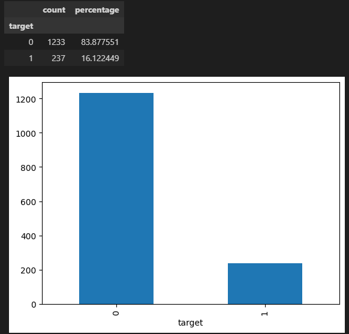
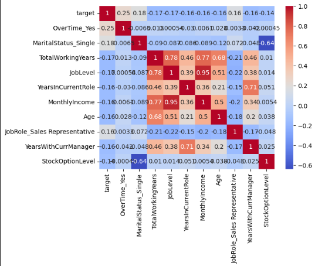
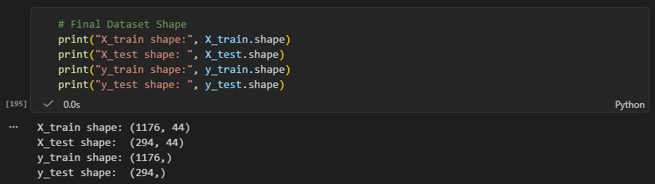

# Initial Dataset Report — IBM HR Analytics Attrition Dataset

## a. Overview

### Dataset Name
**IBM HR Analytics Employee Attrition & Performance**

### Source
- **Platform:** Kaggle 
- **Dataset Slug:** [`pavansubhasht/ibm-hr-analytics-attrition-dataset`](https://www.kaggle.com/datasets/pavansubhasht/ibm-hr-analytics-attrition-dataset) 
- **File:** `WA_Fn-UseC_-HR-Employee-Attrition.csv` 

### Description / Context
This dataset captures HR records — demographic attributes, job role details, compensation, satisfaction scores, and work history — for 1,470 employees.  Each record is labelled with whether the employee left the company (`Attrition = Yes`) or stayed (`Attrition = No`). 

The notebook encodes this target as a binary integer (`1` = Yes, `0` = No) and the preprocessing pipeline is set up accordingly. 

## b. Methodology

### Collection Process
The dataset was downloaded programmatically using the `kagglehub` Python library: 

```python
import kagglehub
path = kagglehub.dataset_download("pavansubhasht/ibm-hr-analytics-attrition-dataset")
```

The CSV file was then loaded into a Pandas DataFrame using `pd.read_csv()`. 

### Tools Used 

| Tool / Library | Purpose |
|---|---|
| `pandas` | Data loading, manipulation, and exploration |
| `numpy` | Numerical operations |
| `matplotlib` / `seaborn` | Data visualization |
| `scikit-learn` (`StandardScaler`, `VarianceThreshold`, `train_test_split`) | Preprocessing and feature selection |
| `kagglehub` | Dataset download from Kaggle |

### Data Size
- **Raw records:** 1,470 rows 
- **Raw features:** 35 columns (including the target `Attrition`) 
- **After preprocessing:** 45 columns (1 target + 44 features, expanded by one-hot encoding) 
- **Train / Test split:** 80% / 20% 
- **Resulting split sizes** (1,176 train / 294 test)


## c. Data Quality Assessment

> **Reading Guide:** ✅ = directly confirmed by the notebook code or output. ⚠️ = not checked or only partially addressed in the notebook.

### A. Accuracy

| Check | Status | Basis |
|---|---|---|
| No missing values | ✅ Confirmed | `df.isnull().sum().sum()` → 0 |
| Values within expected ranges | ⚠️ Not checked | `df[num_cols].describe()` was not run |
| No typos in categorical columns | ⚠️ Not explicitly checked | Encoding ran without errors, implying no unexpected values |
| No duplicate rows | ⚠️ Not checked | `df.duplicated().sum()` was not run |
| No outliers in numerical columns | ⚠️ Not checked | No boxplot or IQR check was performed |

---

### B. Completeness

| Check | Status | Basis |
|---|---|---|
| No null values | ✅ Confirmed | `df.isnull().sum().sum()` → 0 |
| All expected columns present | ✅ Confirmed | All 35 columns loaded successfully |
| All 1,470 rows loaded | ✅ Confirmed | Shape printed as `(1470, 45)` after encoding |

### C. Consistency

| Check | Status | Basis |
|---|---|---|
| Constant columns identified and removed | ✅ Confirmed | `EmployeeCount`, `StandardHours`, `Over18` dropped via `VarianceThreshold` |
| ID column removed | ✅ Confirmed | `EmployeeNumber` dropped — no predictive value |
| Correct data types per column | ⚠️ Not checked | No `df.dtypes` inspection was done before preprocessing |
| No conflicting values across related columns | ⚠️ Not checked | e.g., `YearsAtCompany` > `TotalWorkingYears` would be logically inconsistent |


### D. Label Distribution (Target Variable)
The target column `Attrition` was re-encoded as a binary integer: 

```python
df['target'] = df['Attrition'].apply(lambda x : 1 if x == "Yes" else 0 )
df = df.drop(columns=['Attrition'])
```


## d. Data Preprocessing

### Data Cleaning

1. **Dropped the ID column:** `EmployeeNumber` removed. 
2. **Dropped zero-variance columns:** `EmployeeCount`, `StandardHours`, and `Over18` removed using `VarianceThreshold(threshold=0.05)`. 
3. **Remaining feature set after cleaning:** 31 columns (23 numerical, 7 categorical). 

### Initial Data Exploration (Micro EDA)

**Target distribution:** A bar chart of the target distribution  was plotted and shows a clear class imbalance —with the specific percentages as (~83.9% No, ~16.1% Yes).
 



From our main.ipynb we note that: *"We seem to have some class imbalance. We will need to use other metrics (such as F1 score), and also perhaps conduct some oversampling of the minority or undersampling of the majority (SMOTE)."* 


**Correlation analysis:** A heatmap of the top 10 features most correlated with the target was plotted.  The notebook's own markdown notes: *"Off the bat, overtime seems to be the most correlated variable with target."* 

```python
top_cols = df.corr()['target'].abs().nlargest(11).index
sns.heatmap(df[top_cols].corr(), annot=True, cmap='coolwarm')
```




The broader interpretation or inferenace is that *"workload, job mobility, and financial incentives are key drivers of attrition".

### Feature Engineering & Encoding

Categorical columns were one-hot encoded using `pd.get_dummies()` with `drop_first=True`: 

```python
# This code is found in  Header: Pre-processing under Non-numerical columns

cat_cols = ['BusinessTravel', 'Department', 'EducationField',
            'Gender', 'JobRole', 'MaritalStatus', 'OverTime']

# 4. Encode categorical variables (one-hot encoding)

df = pd.get_dummies(df, columns=cat_cols, drop_first=True, dtype=int)

# Shape after encoding: (1470, 45)
```

### Normalisation

To prevent data leakage, `StandardScaler` was fitted **only on training data** and then applied to the test set:


```python

# ===train normalization

scaler = StandardScaler()
norm_cols = X.columns[X.nunique() > 2]   # non-binary columns
bin_cols  = X.columns[X.nunique() <= 2]  # binary columns (left unchanged)

# ===train normalization

scaler = StandardScaler()

norm_cols = X.columns[X.nunique() > 2]
bin_cols = X.columns[X.nunique() <= 2]

X_train_norm = pd.DataFrame(scaler.fit_transform(X_train[norm_cols]), columns=norm_cols, index=X_train.index)
X_train = pd.concat([X_train_norm, X_train[bin_cols]], axis=1) 

# ===ensure dtypes 

X_train = X_train.astype('float32')
X_test = X_train.astype('float32')

y_train = y_train.astype('long')
y_test = y_train.astype('long')


```

Binary columns were left unscaled, as standardising 0/1 indicator columns would distort their meaning. 

### Final Dataset Shape



**REMEMBER:** Shapes are derived from the 80/20 split of 1,470. Keep note that that `test_size=0.2` , meaning:

- 80% of 1,470 rows → training (1,176 rows)
- 20% of 1,470 rows → testing (294 rows)

And the 44 columns come from the original 30 features expanding to 44 after one-hot encoding the 7 categorical columns.

## e. Challenges, Assumptions, and Next Steps

### Challenges

| Challenge | Source |
|---|---|
| **Class imbalance** (~84% vs ~16%) — standard accuracy is misleading; F1-score and SMOTE are needed. | Explicitly noted in the notebook ✅ |
| **No random seed set** in `train_test_split` — results will differ between runs, making reproducibility difficult. | Observed directly in the notebook ✅ |
| **No range or domain validation** performed — data accuracy is assumed, not verified. | Notebook omission ✅ |
| **Inter-feature correlation** — several features (e.g., `TotalWorkingYears`, `YearsAtCompany`, `Age`) are likely correlated with each other, which may affect model stability. | Inferred from the heatmap ⚠️ |

### Confirmed Assumptions in the Notebook

| Assumption | Where It Appears |
|---|---|
| Binary classification is the intended task | Inferred from binary target + SMOTE/F1 comments ⚠️ |
| Binary columns do not need scaling | Implemented in code, no rationale stated ⚠️ |
| SMOTE will be applied to training data only | Mentioned in comments, not yet implemented ⚠️ |
| Approximate class split is ~84% / ~16% | Estimated from bar chart, not printed ⚠️ |
| Train/test sizes are ~1,176 / ~294 | Calculated from 80/20, not printed ⚠️ |

### Next Steps

The notebook ends at the preprocessing stage. The following steps are inferred as the natural continuation: ⚠️

1. **Set a `random_state`** in `train_test_split` for reproducibility.
2. **Confirm class distribution** — print exact counts via `df['target'].value_counts()`.
3. **Apply SMOTE** on the training set only to address class imbalance.
4. **Train baseline models** — Logistic Regression or Decision Tree as interpretable starting points.
5. **Train advanced models** — explore Gradient Boosting (XGBoost / LightGBM) or Neural Networks.
6. **Evaluate** using F1-score, AUC-ROC, and confusion matrices.
7. **Hyperparameter tuning** via cross-validated grid or Bayesian search.